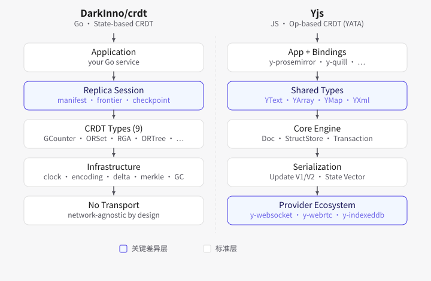

# crdt

[English](README.md) | [简体中文](README.zh-CN.md)

`crdt` is a small, dependency-free Go library for composable state-based CRDTs.
It provides deterministic binary state and delta frames so replicas can converge
despite duplicate delivery, reordering, and temporary partitions.

> Status: first public module release `v1.0.0`; APIs follow semantic versioning.

## Architecture at a glance



This is a conceptual comparison of integration boundaries, not a wire-compatibility,
feature-parity, or performance claim.

## Features

- State-based **G-Counter** with joinable, type-isolated deltas.
- Grow-only **G-Set** with a caller-defined element codec and joinable deltas.
- Add-wins observed-remove **OR-Set** with a caller-defined element codec.
- Causally replicated **MV-Register** that preserves concurrent opaque-byte
  writes instead of resolving them by wall clock.
- Experimental delta-replicated **LWW-Map** with opaque byte values and
  deterministic HLC conflict resolution.
- Hybrid logical clock (HLC) tags and a persistable clock state for replica
  restarts.
- Canonical, checksummed binary frames with bounded decoding and deterministic
  encoding.
- Delta batching/coalescing, versioned snapshots, and Merkle digests for
  anti-entropy workflows.
- Optional exact-acknowledgement tombstone collection with membership epochs.
- Safe concurrent access for the provided CRDT implementations.
- Experimental framed LWW-Map, RGA text, and OR-Tree collections, enabled
  only by an explicit per-replication-group protocol policy. RGA v1 now has
  bounded delayed integration and incremental visible indexing, but its
  tombstone lifecycle remains experimental.

## Scope

This library provides CRDT data types and wire primitives. It deliberately does
not choose a network transport, membership protocol, authentication scheme,
storage backend, or retry policy. `tombstonegc.Coordinator` performs safe
automatic collection only after the application supplies an authoritative,
authenticated active-membership view. It does not discover, authenticate, or
persist that view. A checksum
detects accidental frame corruption; it is not an authenticity or encryption
mechanism.

## Experimental LWW-Map, RGA, and OR-Tree protocols

RGA text v1 (`text`, TypeIDs 11/12) accepts out-of-order deltas through a
bounded delayed-integration queue, rejects incomplete snapshots, and uses an
incremental indexed sequence rather than rebuilding the full visible projection
after each edit. It remains experimental while its full tombstone lifecycle is
validated. Persist its HLC-backed snapshot atomically.

`CompactTombstones` is intentionally conservative: it can collect only deleted
leaves after an authenticated exact-acknowledgement epoch has durably saved a
post-compaction snapshot and retired old deltas. Nodes with descendants remain
structural anchors. LWW-Map, RGA run-v2 (TypeIDs 19/20), and OR-Tree remain
experimental and require explicit opt-in:

```go
policy := crdt.ProtocolPolicy{AllowExperimental: true}
for _, kind := range policy.FrameTypes() {
	// This is only a local capability allowlist, not the full handshake.
	_ = kind
}
```

Before an experimental frame is accepted, bind it to a `replica.Manifest` in
the authenticated handshake. The manifest includes the group, schema, epoch,
codec, and semantics version; pass the same explicit policy to each replica
boundary through `NewChangeWithPolicy`, `NewInboxWithPolicy`,
`NewCheckpointWithPolicy`, and `NewSessionWithPolicy`. Frame type IDs alone do
not establish wire-semantic compatibility.

The zero-value policy advertises only the stable G-Counter, G-Set, OR-Set,
MV-Register, and PN-Counter protocols. The policy is neither a global switch
nor a plugin registry: unknown and reserved frame types remain unsupported.
Experimental LWW-Map, RGA, and OR-Tree replicas must persist HLC state with
snapshots and retain their tombstones.

## Requirements

- Go 1.21 or later

## Install

After the first public release tag is available:

```sh
go get github.com/DarkInno/crdt@v1.0.0
```

Until then, use a local checkout for development:

```sh
git clone https://github.com/DarkInno/crdt.git
cd crdt
go test ./...
```

## Quick start

### G-Counter

Each replica increments only its own component. `Merge` takes the per-replica
maximum, so it is commutative, associative, and idempotent.

```go
package main

import (
	"fmt"
	"log"

	"github.com/DarkInno/crdt/counter"
)

func main() {
	left, err := counter.NewGCounter("left")
	if err != nil {
		log.Fatal(err)
	}
	right, err := counter.NewGCounter("right")
	if err != nil {
		log.Fatal(err)
	}

	if _, err := left.Increment(2); err != nil {
		log.Fatal(err)
	}
	if _, err := right.Increment(3); err != nil {
		log.Fatal(err)
	}
	if err := left.Merge(right); err != nil { // Delivery order does not matter.
		log.Fatal(err)
	}

	value, err := left.Value()
	if err != nil {
		log.Fatal(err)
	}
	fmt.Println(value)
	// Output: 5
}
```

### PN-Counter

A PN-Counter supports independent increments and decrements. It stores
positive and negative per-replica G-Counter components, so merges remain
commutative, associative, and idempotent. `Value` returns an exact `*big.Int`;
use `ValueInt64` when the application requires a bounded machine integer.

```go
counter, err := counter.NewPNCounter("cart")
if err != nil {
	log.Fatal(err)
}
if _, err := counter.Increment(7); err != nil {
	log.Fatal(err)
}
if _, err := counter.Decrement(2); err != nil {
	log.Fatal(err)
}
value, err := counter.Value()
if err != nil {
	log.Fatal(err)
}
fmt.Println(value)
// Output: 5
```

### OR-Set delta replication

An OR-Set uses a stable codec ID and stable encoded element bytes to identify a
set's element type across replicas.

```go
package main

import (
	"fmt"
	"log"

	"github.com/DarkInno/crdt/set"
)

type stringCodec struct{}

func (stringCodec) ID() string                            { return "example.com/string/v1" }
func (stringCodec) Marshal(value string) ([]byte, error)  { return []byte(value), nil }
func (stringCodec) Unmarshal(data []byte) (string, error) { return string(data), nil }

func main() {
	codec := stringCodec{}
	left, err := set.NewORSet("left", codec)
	if err != nil {
		log.Fatal(err)
	}
	right, err := set.NewORSet("right", codec)
	if err != nil {
		log.Fatal(err)
	}

	delta, err := left.Add("item")
	if err != nil {
		log.Fatal(err)
	}
	if err := right.ApplyDelta(delta); err != nil {
		log.Fatal(err)
	}

	fmt.Println(right.Contains("item"))
	// Output: true
}
```

For a remove to be observed by other replicas, send the returned remove delta
or merge the state. An add concurrent with a remove that did not observe its
tag remains present (add-wins semantics).

## End-to-end integration

For a reproducible local HTTP delivery exercise, a production-integration
checklist, snapshot/restart guidance, and the expected convergence evidence,
see the [end-to-end integration tutorial](INTEGRATION.md). The
[runnable collaborative-workboard example](examples/collaborative-board)
models duplicate delivery, a partitioned add/remove conflict, and recovery
from an OR-Set snapshot:

```sh
go run ./examples/collaborative-board
```

The [warehouse replication example](examples/warehouse-replication) shows
framed G-Set and MV-Register deltas, duplicate delivery, concurrent register
values, and safe MV-Register recovery before reusing a replica ID:

```sh
go run ./examples/warehouse-replication
```

The [experimental collaboration example](examples/experimental-collaboration)
uses low, explicit receive and RGA retention limits for LWW-Map, RGA, and
OR-Tree. Run it only after the replication group has completed the
authenticated experimental-protocol handshake described above:

```sh
go run ./examples/experimental-collaboration
```

For the Chinese versions, see [集成教程](INTEGRATION.zh-CN.md) and
[协作任务示例](examples/collaborative-board) and
[仓库复制示例](examples/warehouse-replication) and
[实验协作示例](examples/experimental-collaboration).

## Correct use in a distributed system

- Give every live logical replica a globally unique, non-blank replica ID.
- Persist an OR-Set snapshot atomically with its HLC state. Use
  `ORSet.SnapshotCurrentState()` when the set's own frontier is sufficient, or
  `ORSet.Snapshot(frontier)` when the replication layer has a broader
  acknowledgement frontier; restore with `NewORSetFromSnapshot`. Do not
  restore a same-ID OR-Set from bytes alone.
- For automatic tombstone collection, create a coordinator with a stable
  replication-group ID. Each active member reports its exact
  `ORSet.TombstoneTags()` under that ID and the current
  `tombstonegc.Coordinator` membership epoch; pass both values to
  `AcknowledgeAndCompact` for every received report. Do not derive
  acknowledgements from `Frontier()` when delta delivery can be out of order:
  a maximum tag does not prove that prior tombstones were received. Removing a
  member requires retiring it from replication; a rejoining member must
  bootstrap from a post-compaction snapshot.
- `ORSet.Compact` remains available only for transports that independently
  prove a gap-free causal prefix for every supplied frontier.
- Persist an MV-Register state snapshot before reusing its replica ID. Its
  version vector, not a wall clock, proves which writes a later `Set` observes;
  recover with `register.NewMVRegisterFromSnapshot`.
- Use `ProtocolPolicy.FrameTypes()` as an authenticated connection/setup
  capability advertisement. Send LWW-Map, RGA, or OR-Tree frames only when
  both peers opt in. Persist HLC-backed snapshots atomically. RGA tombstone
  compaction additionally requires an authenticated exact-acknowledgement epoch
  and retirement of old deltas.
- Keep `ElementCodec.ID`, `Marshal`, and `Unmarshal` deterministic and safe for
  concurrent calls. Encoded values must round-trip canonically.
- Treat received bytes as untrusted. Use `UnmarshalBinaryWithLimits` and
  `Unmarshal*DeltaWithLimits` with limits appropriate to the transport.
- Authenticate, authorize, encrypt, retry, and persist messages in the
  surrounding application. CRDT convergence does not provide those guarantees.

## JSON diagnostics

Concrete CRDT state and delta objects implement `json.Marshaler` for structured
logs and human inspection. The output is a compact, stable summary such as:

```json
{"type":"gcounter","replica_id":"left","element_count":2,"tombstone_count":0}
```

It deliberately excludes application values, element keys, tags, clock state,
and binary frames. JSON diagnostics cannot restore or apply a CRDT state or
delta and are not a replication format; use the bounded canonical binary
encoders for that.

## Packages

| Package | Purpose |
| --- | --- |
| `crdt` | Common contracts, state summaries, and mutation tags. |
| `clock` | Hybrid logical clock and persisted HLC state. |
| `counter` | G-Counter, PN-Counter, and their delta codecs. |
| `set` | G-Set, add-wins OR-Set, and element-codec contract. |
| `lww` | In-memory LWW-Set and experimental framed LWW-Map. |
| `text` | Experimental framed RGA collaborative text and run-v2 codec. |
| `tree` | Experimental framed observed-remove tree. |
| `register` | In-memory LWW/max registers and framed causal MV-Register. |
| `encoding` | Versioned bounded binary frames. |
| `delta` | Bounded delta batches and coalescers. |
| `snapshot` | Immutable state snapshots and recovery plans. |
| `merkle` | Deterministic digests for anti-entropy. |
| `tombstonegc` | Exact tombstone acknowledgement and epoch-scoped GC coordination. |

## Development and verification

```sh
go test ./...
go test -race ./...
go vet ./...
make coverage
```

`make verify` additionally runs fuzzing, `staticcheck`, and `golangci-lint`.
Those two tools must be installed on `PATH` locally; GitHub Actions installs
pinned versions. To reproduce the coverage gate in Docker:

```sh
make docker-test
```

### Diagnostic and synchronization probes

`crdt-analyze` verifies one bounded frame before emitting JSON metadata (type,
codec, payload size, and SHA-256 fingerprint):

```sh
go run ./cmd/crdt-analyze -file ./state.frame
```

`crdt-sync-probe` is a short-lived HTTP test utility for exercising duplicate
delta delivery across hosts. It is not a production replication service. Its
default listener is loopback-only; a non-empty token is required for every
endpoint. Prefer `-token-file` (mode `0600`) over `-token`, and bind a public
address only for a controlled test window.

```sh
# On each receiver.
go run ./cmd/crdt-sync-probe -mode serve -replica receiver -token-file ./probe.token

# Generate one delta and send that same byte sequence to every target.
go run ./cmd/crdt-sync-probe -mode send \
  -target http://receiver-a:49511,http://receiver-b:49511 \
  -replica sender -token-file ./probe.token -duplicates 3
```

Use `make test-unit` to run packages independently and `make test-integration`
for the three-replica, recovery, batching, encoding, and anti-entropy flow.

The CI workflow enforces formatting, unit tests, race detection, vet, decoder
fuzzing, static analysis, per-package coverage of at least 90%, and a Go 1.26
container verification.

### Quality and performance snapshot — 2026-07-28

This historical pre-release snapshot was collected on Go 1.26.5. It is
recorded evidence for that revision, not a latency or throughput guarantee for
every workload; the checks below were not re-executed as part of this
documentation update.

- The recorded `make verify` run passed: formatting, independent-package tests, integration and
  extreme scenarios, the race detector, vet, four 10-second decoder fuzz
  campaigns, `staticcheck`, `golangci-lint`, and a per-package coverage gate of
  at least 90%.
- The recorded `make docker-test` run passed with Go 1.26; `govulncheck ./...` found no known
  vulnerabilities.
- A controlled three-host delivery probe confirmed idempotent duplicate
  delivery and rejected unauthorized, malformed, and oversized requests.
- The supplied benchmarks cover G-Counter, PN-Counter, G-Set, OR-Set, and
  MV-Register `Merge`, `ApplyDelta`, and `MarshalBinary`. Run `make benchmark` on your target
  hardware before choosing capacity limits.

The scenario evaluation at the end of this README records the current local
sample for duplicate delivery and both live-state and tombstone-heavy
serialization. Exact results depend on the CPU, Go version, element codec, set
size, and mutation mix.

Run `make test-extreme` to repeat the high-cardinality scenario in normal and
race-instrumented modes. Internal investigation data and deployment runbooks
are intentionally kept outside the public release tree.

## Publishing `v1.0.0`

Before publishing, run the verification commands above, review the public API,
commit the reviewed release contents, and ensure the repository is publicly
reachable at the module path. Then create an immutable semantic-version tag:

```sh
go mod tidy
go test ./...
git tag -a v1.0.0 -m "Release v1.0.0"
git push origin v1.0.0
GOPROXY=proxy.golang.org go list -m github.com/DarkInno/crdt@v1.0.0
```

Do not move or reuse a published tag. For Go modules, breaking changes after
the first stable release require a new major-version module path such as
`github.com/DarkInno/crdt/v2`.

## Contributing

Please open an issue before proposing an API expansion. Contributions should
include focused tests, preserve deterministic wire encoding, keep untrusted
input bounded, and pass the verification commands above.

## Scenario performance evaluation — 2026-07-28

Measured locally on an Apple M4 Pro with Go 1.26.5 (`darwin/arm64`). The
fixture contains 128 string elements; each result is the rounded mean of three
two-second samples. Allocation values were stable across samples.

| Scenario | `GOMAXPROCS=1` | `GOMAXPROCS=4` | Allocation per operation |
| --- | ---: | ---: | ---: |
| `Merge` | 56.0 µs/op | 42.9 µs/op | 57,768 B; 259 allocs |
| Duplicate `ApplyDelta` | 131 ns/op | 131 ns/op | 0 B; 0 allocs |
| Parallel duplicate `ApplyDelta` | 132 ns/op | 105 ns/op | 0 B; 0 allocs |
| `MarshalBinary` (128 live elements) | 36.8 µs/op | 26.6 µs/op | 29,952 B; 132 allocs |
| `MarshalBinary` (tombstone-heavy) | 24.8 µs/op | 17.4 µs/op | 15,616 B; 2 allocs |

`Merge`, ordinary `ApplyDelta`, and `MarshalBinary` use serial benchmark
loops; their `GOMAXPROCS=4` values are runtime-setting samples, not four-core
throughput measurements. Only the parallel duplicate-delivery row uses
`RunParallel`. Compared with an earlier local sample using the same live-state
fixture and method, `MarshalBinary` now uses 29,952 B and 132 allocations per
operation, down from 96,312 B and 778 allocations. These are local
pre-release measurements, not capacity planning or SLA guarantees; rerun
`make benchmark` on the deployment target before setting limits.

## PN-Counter performance evaluation — 2026-07-28

Measured on two independent Debian 13 (`linux/amd64`) hosts, each with four
Intel Xeon Platinum 8272CL vCPUs and 3.8 GiB memory. The benchmark binary was
built from this revision with Go 1.26.5 and run three times per setting with
`-benchtime=2s`; values below are rounded means. The fixture has 128 replica
components in each positive and negative map. `MarshalBinary` includes its
reported encoded-throughput sample in parentheses; allocation counts were
identical in all three runs.

| Host | `GOMAXPROCS` | `Merge` | `ApplyDelta` | `Value` | `MarshalBinary` |
| --- | ---: | --- | --- | --- | --- |
| `210.16.171.72` | 1 | 24.9 µs/op; 13,136 B; 6 allocs | 149.1 ns/op; 0 B; 0 allocs | 7.51 µs/op; 232 B; 10 allocs | 69.4 µs/op (55.3 MB/s); 25,680 B; 10 allocs |
| `210.16.171.72` | 4 | 18.6 µs/op; 13,136 B; 6 allocs | 151.8 ns/op; 0 B; 0 allocs | 7.29 µs/op; 232 B; 10 allocs | 53.6 µs/op (71.7 MB/s); 25,680 B; 10 allocs |
| `192.140.163.250` | 1 | 25.6 µs/op; 13,136 B; 6 allocs | 151.8 ns/op; 0 B; 0 allocs | 7.49 µs/op; 232 B; 10 allocs | 70.4 µs/op (54.6 MB/s); 25,680 B; 10 allocs |
| `192.140.163.250` | 4 | 18.5 µs/op; 13,136 B; 6 allocs | 153.5 ns/op; 0 B; 0 allocs | 7.31 µs/op; 232 B; 10 allocs | 53.3 µs/op (72.1 MB/s); 25,680 B; 10 allocs |

The `GOMAXPROCS=4` rows remain serial benchmark measurements, not aggregate
four-core throughput. These controlled host samples are public regression
evidence for this revision, not capacity limits or SLA guarantees; rerun the
same command on the deployment target before setting production limits:

```sh
GOMAXPROCS=4 go test -run='^$' \
  -bench='^BenchmarkPNCounter(Merge|ApplyDelta|Value|MarshalBinary)$' \
  -benchmem -benchtime=2s ./counter
```

## License

SPDX-License-Identifier: MIT

Licensed under the [MIT License](LICENSE). Copyright (c) 2026 DarkInno.
